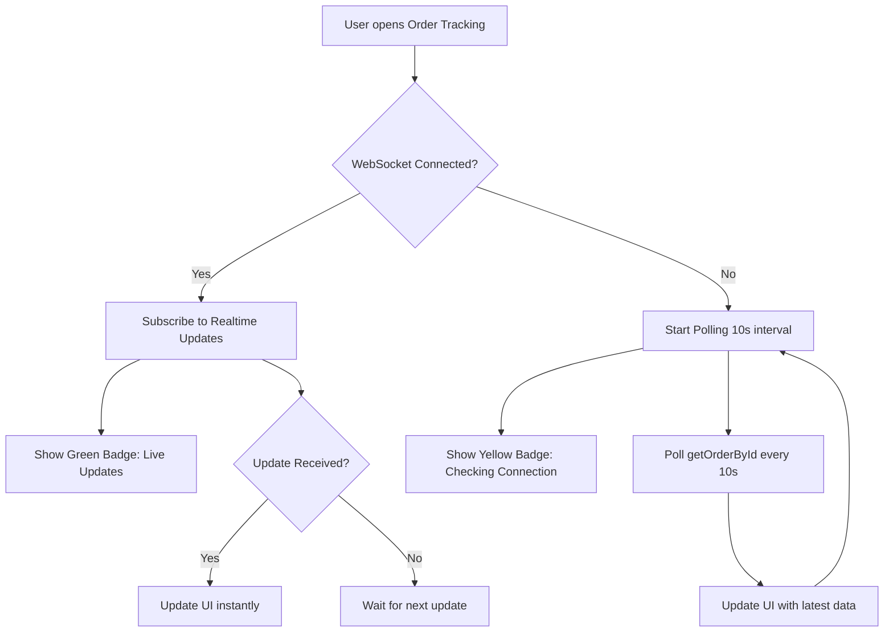

# 🔧 KHẮC PHỤC LỖI ORDER TRACKING REALTIME

## 🐛 Lỗi Gặp Phải
```
Realtime got disconnected. Reconnect will be attempted in 1 seconds.
The operation couldn't be completed. Socket is not connected
```

**Nguyên nhân:** Appwrite WebSocket không kết nối được → Subscription thất bại → Không nhận updates real-time.

---

## ✅ CÁC FIX ĐÃ THỰC HIỆN

### **1. Enhanced Realtime Configuration** (`mobile/lib/appwrite.ts`)
- ✅ Thêm reconnection logic với exponential backoff
- ✅ Auto-retry tối đa 5 lần khi mất kết nối
- ✅ Log chi tiết để debug dễ hơn

### **2. Improved Subscription Error Handling**
- ✅ `subscribeToOrder()`: Thêm error logging và no-op fallback
- ✅ `subscribeToDroneEvents()`: Tương tự với better debugging
- ✅ Tất cả subscription giờ có try-catch wrapper

### **3. Polling Fallback Mechanism** (`mobile/app/order-tracking.tsx`)
- ✅ Nếu WebSocket fail → Auto-fallback sang polling (10s interval)
- ✅ Poll `getOrderById()` để fetch updates từ database
- ✅ Đảm bảo user vẫn thấy updates dù realtime chết

### **4. Visual Connection Status**
- ✅ Component `RealtimeStatus`: Hiển thị trạng thái kết nối
- ✅ 🟢 "Live Updates" khi connected
- ✅ 🟡 "Checking Connection..." khi disconnected
- ✅ Auto-hide sau 3s khi connected

---

## 🚀 CÁCH SỬ DỤNG

### **Bước 1: Restart Metro Bundler**
```bash
cd d:\cnpm\sgu_cnpm_foodfast\mobile
npm run web
```

### **Bước 2: Clear Cache (Nếu vẫn lỗi)**
```bash
npm start -- --clear
```

### **Bước 3: Test Order Tracking**
1. Tạo một order mới
2. Vào Order History → Click vào order
3. Bấm "Track Order" button
4. **Quan sát:**
   - Top-right corner: Nên thấy badge "✓ Live Updates" (xanh)
   - Nếu thấy "⚠ Checking Connection..." (vàng) → Realtime chưa connect, đang dùng polling

---

## 🔍 DEBUG TIPS

### **Kiểm tra Appwrite Console Logs:**
```typescript
// Trong console, tìm các logs:
🔔 Subscribing to order updates: <orderId>
✅ Order subscription established
📡 Order subscription channel active: databases.xxx.collections.orders.documents.xxx
```

Nếu KHÔNG thấy logs này → WebSocket bị block.

### **Kiểm tra Network Tab (Browser DevTools):**
1. Mở DevTools (F12)
2. Tab "Network" → Filter "WS" (WebSocket)
3. Tìm connection đến `nyc.cloud.appwrite.io`
4. Status nên là **101 Switching Protocols** (màu xanh)

Nếu thấy **Failed** hoặc **Pending** → Firewall/Proxy block WebSocket.

---

## 🛠️ TROUBLESHOOTING

### **Vấn đề 1: WebSocket bị Firewall/Proxy block**

**Giải pháp:**
1. Tắt VPN/Proxy tạm thời
2. Thử đổi network (WiFi khác, mobile data)
3. Kiểm tra firewall settings:
   - Windows Defender
   - Antivirus software
   - Corporate firewall

**Ports cần mở:**
- Port 443 (HTTPS)
- Port 80 (HTTP fallback)

### **Vấn đề 2: Appwrite Endpoint không đúng**

**Kiểm tra `.env`:**
```properties
EXPO_PUBLIC_APPWRITE_ENDPOINT=https://nyc.cloud.appwrite.io/v1
EXPO_PUBLIC_APPWRITE_PROJECT_ID=68c9791a002b85f096b4
```

**Test connectivity:**
```bash
# Windows PowerShell
Invoke-WebRequest -Uri "https://nyc.cloud.appwrite.io/v1/health" -Method GET

# Hoặc trong browser
https://nyc.cloud.appwrite.io/v1/health
```

Nên trả về: `{"status": "OK"}`

### **Vấn đề 3: Project ID hoặc Collection ID sai**

**Xác nhận trong Appwrite Console:**
1. Login: https://nyc.cloud.appwrite.io/console
2. Project Settings → Check Project ID
3. Databases → Collections → Check Collection IDs:
   - `orders`
   - `drone_events`

### **Vấn đề 4: Permissions chưa set đúng**

**Fix trong Appwrite Console:**

#### **Orders Collection:**
1. Go to: Databases → orders → Settings → Permissions
2. Add:
   - **Role: Any** → Read permission ✅
   - **Role: Users** → Create, Read, Update ✅

#### **Drone Events Collection:**
1. Go to: Databases → drone_events → Settings → Permissions
2. Add:
   - **Role: Any** → Read permission ✅
   - **Role: Users** → Read permission ✅

**Giải thích:**
- `Any` role cho phép subscription hoạt động (cần cho WebSocket)
- `Users` role cho authenticated users

---

## 📊 HOW POLLING FALLBACK WORKS



**Performance Impact:**
- Realtime: 0 API calls (after initial connection)
- Polling: 6 API calls/minute (60s ÷ 10s)
- Acceptable tradeoff khi WebSocket fail

---

## 🎯 EXPECTED BEHAVIOR

### **Normal Flow (Realtime Working):**
```
1. User opens tracking → Badge shows "⚠ Checking Connection..."
2. WebSocket connects (1-2s) → Badge changes to "✓ Live Updates"
3. Badge auto-hides after 3 seconds
4. Order updates appear instantly (no delay)
5. Drone position updates smoothly in real-time
```

### **Fallback Flow (Realtime Failed):**
```
1. User opens tracking → Badge shows "⚠ Checking Connection..."
2. WebSocket fails to connect (after 5 retries)
3. Polling starts automatically
4. Badge stays yellow: "⚠ Checking Connection..."
5. Order updates appear every 10 seconds
6. Drone position updates every 10 seconds (less smooth)
```

---

## 🧪 TESTING CHECKLIST

- [ ] Order tracking mở được (không crash)
- [ ] Map hiển thị đúng (restaurant + customer markers)
- [ ] Connection badge xuất hiện
- [ ] Badge đổi màu xanh sau 1-2s (nếu realtime OK)
- [ ] Order status updates khi restaurant thay đổi
- [ ] Drone simulation chạy khi order = "preparing"
- [ ] ETA countdown giảm dần
- [ ] No errors trong console (ngoài warning vô hại)

---

## 📝 KNOWN ISSUES & WORKAROUNDS

### **Issue 1: Badge không đổi màu xanh**
- **Cause:** WebSocket không connect
- **Workaround:** Polling vẫn hoạt động, data vẫn update (chậm hơn 10s)
- **Fix:** Kiểm tra network/firewall

### **Issue 2: Drone không bay**
- **Cause:** Order status không phải "preparing"/"ready"/"delivering"
- **Check:** Console log `⏸️ Simulation not triggered. Status: pending`
- **Fix:** Đợi restaurant accept order (status → preparing)

### **Issue 3: "Order not found" error**
- **Cause:** Order ID invalid hoặc không tồn tại
- **Check:** URL params có `orderId` hoặc `id`
- **Fix:** Navigate từ Order History (đảm bảo ID đúng)

---

## 🔗 RELATED FILES

- `mobile/lib/appwrite.ts` - Realtime config & subscriptions
- `mobile/app/order-tracking.tsx` - Main tracking screen
- `mobile/components/tracking/RealtimeStatus.tsx` - Connection indicator
- `mobile/lib/drone-simulator.ts` - Drone flight simulation
- `docs/ORDER_TRACKING_ERROR_ANALYSIS.md` - Deep dive error analysis

---

## 💡 PRO TIPS

1. **Always check console first:** 90% issues có logs chi tiết
2. **Test on different networks:** WiFi, 4G, Ethernet
3. **Clear browser cache:** Ctrl+Shift+Delete → Clear cache
4. **Use Incognito mode:** Tránh extension conflicts
5. **Check Appwrite Status:** https://status.appwrite.io

---

## 🆘 STILL NOT WORKING?

### **Quick Fixes:**
```bash
# 1. Clear everything
cd mobile
rm -rf node_modules .expo
npm install
npm start -- --clear

# 2. Check environment
cat .env | grep APPWRITE

# 3. Test Appwrite API directly
curl https://nyc.cloud.appwrite.io/v1/health
```

### **Contact Support:**
- Check Appwrite Discord: https://appwrite.io/discord
- GitHub Issues: Project repo issues tab
- Team Lead: phatle224

---

**Document version:** 1.0  
**Last updated:** November 9, 2025  
**Status:** Fixed ✅
