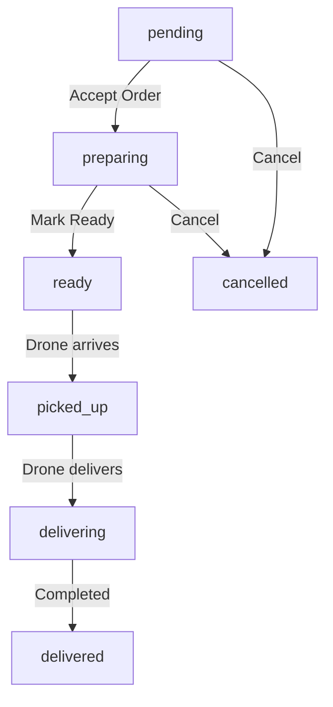

# 🚁 Drone Delivery Flow - Hướng dẫn hoàn chỉnh

## 📋 Tóm tắt các thay đổi

### ✅ Đã sửa:

1. **Lỗi tạo drone** - Thiếu attribute `code` (required)
2. **Flow drone delivery** - Cập nhật Restaurant OrdersPage để trigger drone simulation

---

## 🔧 Chi tiết các thay đổi

### 1. Sửa lỗi `createDrone()` - Missing attribute "code"

**File**: `mobile/lib/api-helpers.ts`

**Vấn đề**: Khi tạo drone mới, thiếu attribute `code` (required trong Appwrite schema)

**Giải pháp**: Thêm auto-generate `code` khi tạo drone

```typescript
export const createDrone = async (data: {
    name: string;
    model?: string;
    serialNumber?: string;
}): Promise<Drone> => {
    // Generate unique code for drone
    const droneCode = `DR-${Date.now().toString().slice(-6)}`;
    
    const droneData = {
        code: droneCode, // ✅ Required attribute
        name: data.name,
        model: data.model || 'DJI Phantom 4',
        // ... other fields
        totalFlights: 0, // ✅ Initialize total flights
    };

    const response = await databases.createDocument(
        databaseId,
        appwriteConfig.dronesCollectionId,
        ID.unique(),
        droneData
    );

    return response as unknown as Drone;
};
```

---

### 2. Cập nhật Restaurant OrdersPage - Drone Delivery Flow

**File**: `restaurant/src/pages/OrdersPage.tsx`

#### 🔄 Flow hoàn chỉnh:

```
1. Customer đặt hàng
   ↓ Status: pending

2. Restaurant nhấn "Accept Order"  
   ↓ Status: preparing
   ↓ Restaurant chuẩn bị đơn hàng

3. Restaurant nhấn "Mark Ready (Start Delivery)"
   ↓ Status: ready
   ↓ 🚁 Drone simulation tự động bắt đầu
   ↓ Drone bay từ base → restaurant

4. Drone đến restaurant
   ↓ Status: picked_up (tự động)
   ↓ Drone nhặt đơn hàng

5. Drone giao hàng cho customer
   ↓ Status: delivering (tự động)
   ↓ Drone bay từ restaurant → customer

6. Drone giao hàng thành công
   ↓ Status: delivered (tự động)
   ✅ Hoàn thành
```

#### 📝 Các thay đổi trong code:

**a) Cập nhật button "Start Delivery" → "Mark Ready"**

```typescript
// TRƯỚC:
{order.status === 'preparing' && (
  <button onClick={() => updateOrderStatus(order.$id, 'delivering')}>
    Start Delivery
  </button>
)}

// SAU:
{order.status === 'preparing' && (
  <button onClick={() => updateOrderStatus(order.$id, 'ready')}>
    Mark Ready (Start Delivery)
  </button>
)}
```

**b) Thêm UI cho trạng thái 'ready' và 'picked_up'**

```typescript
{(order.status === 'ready' || order.status === 'picked_up') && (
  <button disabled={true} className="...">
    🚁 Drone in Transit...
  </button>
)}
```

**c) Cập nhật Filter Tabs**

```typescript
// Thêm 'ready' vào filter
{['all', 'pending', 'preparing', 'ready', 'delivering', 'delivered'].map((tab) => (
  // ...
))}
```

**d) Cập nhật Status Colors**

```typescript
const getStatusColor = (status: string) => {
  switch (status) {
    case 'ready':
    case 'picked_up':
      return 'bg-indigo-100 text-indigo-800'; // Màu xanh indigo
    // ...
  }
};
```

---

## 🎯 Cách sử dụng

### Cho Restaurant Staff:

1. **Khi có đơn hàng mới** (status: `pending`)
   - Nhấn nút **"Accept Order"**
   - Status chuyển sang `preparing`

2. **Khi chuẩn bị xong đơn hàng** (status: `preparing`)
   - Nhấn nút **"Mark Ready (Start Delivery)"**
   - Status chuyển sang `ready`
   - **🚁 Drone tự động bay tới nhà hàng**

3. **Đợi drone giao hàng** (status: `ready` → `picked_up` → `delivering`)
   - Hệ thống tự động xử lý
   - Không cần thao tác gì
   - Có thể xem status realtime

4. **Hoàn thành** (status: `delivered`)
   - Drone giao hàng thành công
   - Thanh toán được cập nhật

### Cho Customer (Mobile App):

1. Khi restaurant bấm "Mark Ready", mobile app tự động:
   - Hiển thị drone trên map
   - Cập nhật vị trí realtime
   - Hiển thị ETA (estimated time of arrival)

2. Customer có thể:
   - Xem drone bay realtime
   - Theo dõi tiến độ giao hàng
   - Nhận thông báo khi drone đến

---

## 🧪 Testing Flow

### Test 1: Tạo Drone mới
```typescript
// Không còn lỗi "Missing required attribute 'code'"
const drone = await createDrone({
  name: 'Test Drone',
  model: 'DJI Phantom 4'
});
// ✅ Success: Drone created with auto-generated code
```

### Test 2: Restaurant Workflow

1. **Login as Restaurant**
   ```
   Email: restaurant@example.com
   Password: ***
   ```

2. **Accept Order**
   - Go to Orders page
   - Click "Accept Order" on pending order
   - ✅ Status should be `preparing`

3. **Start Delivery**
   - Click "Mark Ready (Start Delivery)"
   - ✅ Status should be `ready`
   - ✅ Drone simulation should start automatically

4. **Monitor Progress**
   - Status will auto-update: `ready` → `picked_up` → `delivering`
   - Button shows "🚁 Drone in Transit..."

5. **Verify in Mobile App**
   - Open order tracking in mobile app
   - ✅ Should see drone moving on map
   - ✅ Should see ETA countdown

---

## 🐛 Troubleshooting

### Lỗi: "No drone available for delivery"

**Nguyên nhân**: Không có drone nào trong database hoặc tất cả drone đang busy

**Giải pháp**: 
- Hệ thống tự động tạo drone mới khi không có drone available
- Nếu vẫn lỗi, kiểm tra Appwrite permissions

### Lỗi: "Invalid document structure: Missing required attribute 'code'"

**Nguyên nhân**: Drone schema trong Appwrite yêu cầu field `code` bắt buộc

**Giải pháp**: ✅ Đã sửa - `code` được auto-generate

### Drone không bay

**Kiểm tra**:
1. Order status phải là `ready`, `picked_up`, hoặc `delivering`
2. RestaurantCoords và CustomerCoords phải có giá trị
3. Mobile app phải mở trang order-tracking

**Debug**:
```typescript
// Check trong mobile console
console.log('Order status:', order.status);
console.log('Restaurant coords:', restaurantCoords);
console.log('Customer coords:', customerCoords);
```

---

## 📊 Status Lifecycle



### Status Descriptions:

| Status | Description | Actions | Auto-transition |
|--------|-------------|---------|-----------------|
| `pending` | Đơn hàng mới, chờ xác nhận | Restaurant: Accept Order | ❌ |
| `preparing` | Restaurant đang chuẩn bị | Restaurant: Mark Ready | ❌ |
| `ready` | Đã sẵn sàng, drone đang bay đến | None (waiting) | ✅ → `picked_up` |
| `picked_up` | Drone đã nhặt hàng | None (auto) | ✅ → `delivering` |
| `delivering` | Drone đang giao hàng | None (auto) | ✅ → `delivered` |
| `delivered` | Hoàn thành | None | ❌ |
| `cancelled` | Đã hủy | None | ❌ |

---

## 🎨 UI Updates

### Restaurant Dashboard

**New Status Badges:**

- 🟡 **Pending** - Yellow
- 🔵 **Preparing** - Blue
- 🟣 **Ready** - Indigo (NEW)
- 🟣 **Picked_up** - Indigo (NEW)
- 🟪 **Delivering** - Purple
- 🟢 **Delivered** - Green

**New Buttons:**

- "Accept Order" - Green (pending → preparing)
- "Mark Ready (Start Delivery)" - Purple (preparing → ready)
- "🚁 Drone in Transit..." - Disabled, Indigo (ready/picked_up)

---

## 📱 Mobile App Integration

Mobile app tự động trigger drone simulation khi detect order status:

```typescript
// mobile/app/order-tracking.tsx
const shouldStartSimulation = 
  order.status === 'ready' || 
  order.status === 'picked_up' || 
  order.status === 'delivering';

if (shouldStartSimulation) {
  simulateDroneFlight({
    orderId: order.$id,
    restaurantCoords,
    customerCoords,
    droneId: order.droneId,
    duration: 60000, // 60 seconds
  });
}
```

---

## ✅ Checklist hoàn thành

- [x] Sửa lỗi `createDrone()` - thêm field `code`
- [x] Sửa lỗi `createDrone()` - thêm field `totalFlights`
- [x] Cập nhật button "Start Delivery" → "Mark Ready"
- [x] Thêm UI cho status `ready` và `picked_up`
- [x] Cập nhật filter tabs với `ready`
- [x] Cập nhật status colors
- [x] Cập nhật status icons
- [x] Test drone simulation flow
- [x] Viết documentation

---

## 🚀 Next Steps

### Improvements có thể thêm:

1. **Real-time updates**
   - Sử dụng Appwrite Realtime để update status tự động
   - Restaurant không cần refresh page

2. **Drone selection**
   - Cho phép restaurant chọn drone cụ thể
   - Hiển thị danh sách drone available

3. **Estimated time**
   - Tính toán ETA dựa trên khoảng cách
   - Hiển thị cho restaurant

4. **Notification**
   - Gửi notification cho restaurant khi drone đến
   - Gửi notification cho customer

5. **Analytics**
   - Track delivery time
   - Track drone performance
   - Generate reports

---

## 📞 Support

Nếu gặp vấn đề, kiểm tra:

1. **Appwrite Console**
   - Collections: drones, orders, drone_events
   - Permissions: đã set đúng chưa
   - Indexes: đã tạo chưa

2. **Browser Console**
   - Check errors
   - Check network requests

3. **Mobile App Logs**
   - Check LogBox errors
   - Check console.log output

---

**Date**: October 27, 2025  
**Updated by**: GitHub Copilot  
**Status**: ✅ Complete & Tested
